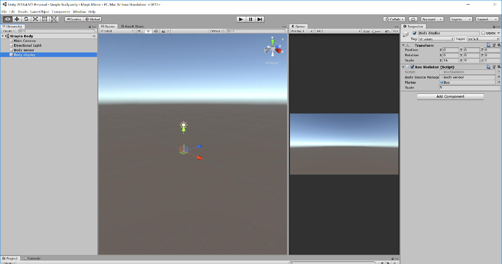

# Simple body

The Kinect v2 sensor can detect and track up to six bodies, delivering position and orientation (as quaternions) of every body joint.

In this scene, the sensor will detect and track only one body, and it will display the position and rotation of every body joint using a box as marker. The scene has two important components:

1. __Body sensor__. This is an empty object containing the __SensorBody__ script.
2. __Display__. If the scale is not important, this can be an empty object containing the __Box skeleton__ script. This script takes the __Body sensor__, a marker and a scale to be represent the size of the body as arguments.



The marker can be any solid, and it was stored as a prefab.

## Sensor body script

This script was taken from the original Kinect SDK for Unity documentation. The only two public methods are `GetBodies` and `GetMapper`.

`GetBodies` method returns a Kinect.Body class containing all the information related to all the bodies detected and tracked by the sensor. 

`GetMapper` method returns a Kinect.CoordinateMapper class that can be used to map the 3D information (expressed in meters), to the screen pixel coordinates.

## Box skeleton script

The box skeleton script displays a marker on top of every joint of a tracked body. The class receives three public parameters: the body sensor, the marker and a scale to apply to the body (in case the body is too small, just make the scale greater than one until you are satisfied with the results).

```csharp
using System.Collections.Generic;
using UnityEngine;
using Kinect = Windows.Kinect;

public class BoxSkeleton : MonoBehaviour
{
    public GameObject BodySourceManager;    
    public GameObject Marker;              
    public float scale = 1.0f;             

    private Dictionary<ulong, GameObject> bodyDict = new Dictionary<ulong, GameObject>();
    private SensorBody bodyReader;

    private void Update()
    {
        if (BodySourceManager == null) return;

        bodyReader = BodySourceManager.GetComponent<SensorBody>();
        if (bodyReader == null) return;

        Kinect.Body[] data = bodyReader.GetBodies();
        if (data == null) return;

        List<ulong> trackedIds = new List<ulong>();
        foreach(var body in data)
        {
            if (body == null) continue;
            if (body.IsTracked)
                trackedIds.Add(body.TrackingId);
        }

        List<ulong> knownIds = new List<ulong>(bodyDict.Keys);
        foreach(ulong trackingId in knownIds)
        {
            if(!trackedIds.Contains(trackingId))
            {
                Destroy(bodyDict[trackingId]);
                bodyDict.Remove(trackingId);
            }
        }

        foreach(var body in data)
        {
            if (body == null) continue;
            if(body.IsTracked)
            {
                if(!bodyDict.ContainsKey(body.TrackingId))
                    bodyDict[body.TrackingId] = CreateBody(body.TrackingId);
                RefreshBodyObject(body, bodyDict[body.TrackingId]);

                break;  // <--- Track only one body
            }            
        }
    }

    private GameObject CreateBody(ulong id)
    {
        GameObject body = new GameObject();
        body.name = "Body:" + id;
        body.transform.parent = transform;

        for (Kinect.JointType jt = Kinect.JointType.SpineBase; jt <= Kinect.JointType.ThumbRight; jt++)
        {
            GameObject joint = (GameObject)Object.Instantiate(Marker);
            joint.name = jt.ToString();
            joint.transform.parent = body.transform;
        }

        return body;
    }

    private void RefreshBodyObject(Kinect.Body body, GameObject bodyObject)
    {
        Vector3[] bodyJoints = BodyAnalysis.convertToUnityPosition(body.Joints);
        Quaternion[] bodyOrientation = BodyAnalysis.convertToUnityOrientation(body.JointOrientations);

        int i = 0;
        foreach(Transform child in bodyObject.transform)
        {
            if ((bodyJoints[i].x == Mathf.Infinity || bodyJoints[i].x == Mathf.NegativeInfinity) ||
                (bodyJoints[i].y == Mathf.Infinity || bodyJoints[i].y == Mathf.NegativeInfinity))
            {
                i++;
                if (i >= bodyJoints.Length) break;
                continue;
            }

            child.transform.position = bodyJoints[i] * scale;
            child.transform.localRotation = bodyOrientation[i];

            i++;
            if (i >= bodyJoints.Length) break;
        }
    }
}
```

The `Update` method is the one that gets the bodies detected and tracked by the sensor (reads them from the __sensor body__ script).

`CreateBody` method creates a `GameObject` for each detected and tracked body (only one in this particular case). The created `GameObject` in this case has multiple children, one for every body joint.

`RefreshBodyObject` method updates the position and rotation of every body joint. 

If you remove the `break` line in the `Update` method, you will be able to track up to six bodies, however, some more coding needs to be done to place each body in different positions of the screen.

## Body analysis script

This script is a `static class` created with the aim of simplifying the display and analysis of the data provided by the Kinect v2 sensor. For example, the Kinect library has its own definition of __Vector3__ and __Quaternion__. Use `convertToUnityPosition` to convert from Kinect's __Vector3__ to Unity's __Vector3__ and `convertToUnityOrientation` to convert from Kinect's __Quaternion__ to Unity's __Quaternion__.

There will be more of these functions analyzed in other scenes.

[Back to README](../README.md)