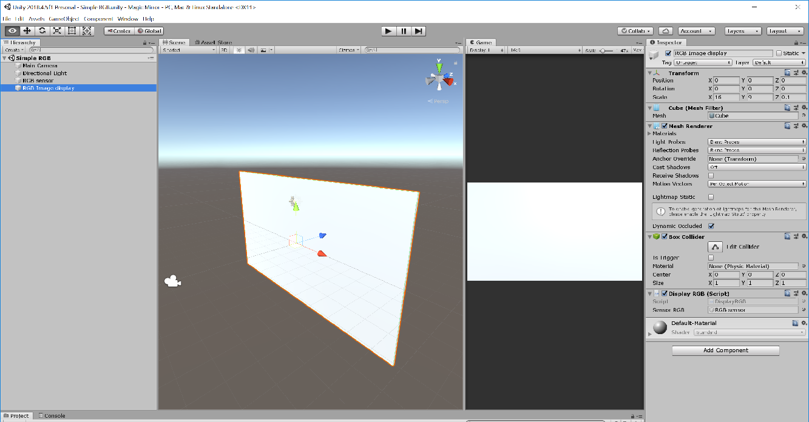

# Simple RGB scene

To acquire and display RGB images from the Kinect v2 sensor, there are two important components to be added to the scene. 

1. __Sensor RGB__. This is an empty object containing the __SensorRGB__ script.
2. __Display__. In this scene, a cube was created to display the RGB image, however, any solid can do the job. Add the __DisplayRGB__ script and remember to parse the __Sensor RGB__ as a reference to 

To keep the image in the right proportions, the cube should have an aspect ratio of 16:9 in one of its faces. Recall that kinect v2 sensor delivers a color image with 1920 pixels width and 1080 pixels height.

[Back to README](../README.md)