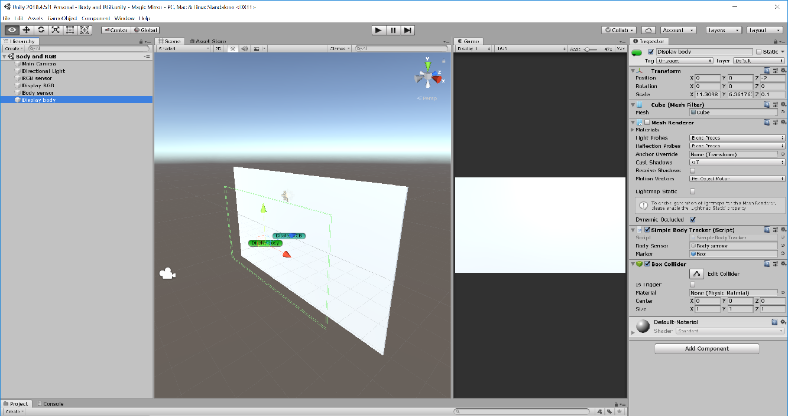

# Body and RGB scene

This is the first example of an __Augmented Reality__ application using the Kinect v2 sensor. There are four important components to add:

1. __RGB sensor__. Just as in the "Simple RGB" scene, this is an empty object containing the __SensorRGB__ script.

2. __RGB display__. Same as in "Simple RGB" scene, this is a cube with aspect ratio of 16:9, the __DisplayRGB__ script and a reference to the __RGB sensor__ on it.

3. __Body sensor__. This is an empty object containing a __SensorBody__ script.

4. __Body display__. This is a cube object that does not display its mesh. The size of this cube is adjusted to fill the size of the camera at a distance of 2 units in front of the __RGB display__. This object uses the __SimpleBodyTracker__ script, which takes a reference to the __Body sensor__ and a __marker__ as inputs.

The marker can be any solid, and it was stored as a prefab.

[Back to README](../README.md)