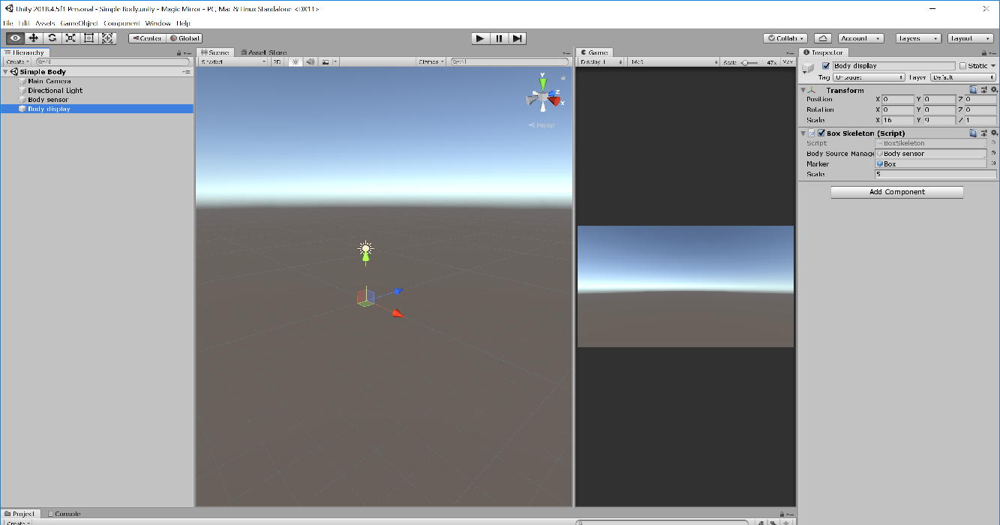

# Simple body

The Kinect v2 sensor can detect and track up to six bodies, delivering position and orientation (as quaternions) of every body joint.

In this scene, the sensor will detect and track only one body, and it will display the position and rotation of every body joint using a box as marker. The scene has two important components:

1. __Body sensor__. This is an empty object containing the __SensorBody__ script.
2. __Display__. If the scale is not important, this can be an empty object containing the __Box skeleton__ script. This script takes the __Body sensor__, a marker and a scale to be represent the size of the body as arguments.

The marker can be any solid, and it was stored as a prefab.

[Back to README](../README.md)